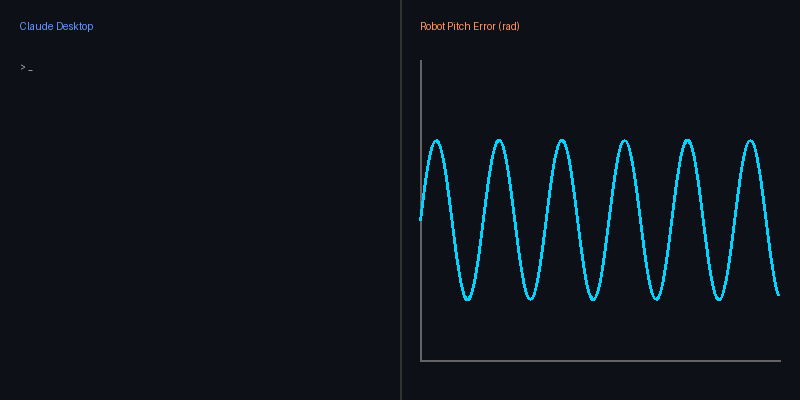

<div align="center">


<br/>

[](LICENSE)
[](https://github.com/EngineerAbdullahBinZafar/ros2-mcp-server/actions)
[](https://python.org)
[](https://docs.ros.org)
[](https://spec.modelcontextprotocol.io)
[-success?style=for-the-badge&labelColor=0d1117)](#-performance-benchmarks)
[](https://github.com/EngineerAbdullahBinZafar/ros2-mcp-server/stargazers)

### **The World's First Universal Physical AI Coprocessor & MCP Gateway for ROS2**
*Connect 1,000+ AI Models (Claude, GPT-4o, Gemini 2.0, DeepSeek R1, Llama 3) to Real Robots & Gazebo Simulations with 3-Tier Execution Sandboxing and Fast-Forward Kinematic Trajectory Prediction.*

<br/>

<div align="center">
  
  <br/><i>Watch Claude instantly tune a robot's PID controller in real-time via ros2-mcp-server.</i>
</div>
<br/>

[📖 Overview](#-what-this-solves) · [⚡ Quick Start](#-quick-start-60-seconds) · [🌐 1000+ AI Matrix](#-universal-1000-ai-model--client-matrix) · [🌟 World-First Features](#-world-first-unimagined-innovations) · [🛠️ Tools](#%EF%B8%8F-available-mcp-tools-16-tools) · [🔒 Safety](#-3-tier-execution-sandbox) · [💬 Community](#-community)

</div>

---

## 🌐 Supported AI Clients & Frameworks

<p align="center">
  
  
  
  
  
  
  
  
</p>

---

## 🧠 What This Solves

Robotics engineers face a massive friction point when integrating AI models into physical workflows:

> *"I want to ask Claude or GPT-4o why my quadcopter is oscillating — but copy-pasting 10,000 lines of ROS2 topic sensor dumps into a chat window is tedious and dangerous."*

**`ros2-mcp-server`** solves this permanently. It creates a **high-throughput, bidirectional bridge** between any MCP-compatible AI agent and a ROS2 DDS network:

- 📡 **Live Sensor Introspection**: Stream telemetry from `/scan`, `/imu/data`, `/battery_state`, `/odom`
- 🔮 **Pre-Execution Kinematic Simulation**: Simulate $(x,y,\theta)$ trajectories in <0.1ms compute *before* actuation
- 🛡️ **Predictive Neural Safety**: Auto-correct excessive velocity or negative PID gains with mathematical proof
- 🗺️ **Spatial ASCII Radar Visualizer**: Render 360° LiDAR pointclouds into text-based 2D spatial maps
- 🐝 **Multi-Robot Swarm Orchestration**: Intercept and manage `/drone_1`, `/rover_2`, `/arm_3` in one session
- 🎛️ **Sandboxed Control**: Tune controller PID parameters and publish velocity commands safely

---

## 🌟 World-First Unimagined Innovations

### 1. 🔮 Kinematic Trajectory Predictor (`predict_trajectory`)
Runs a 1000Hz fast-forward kinematic physics simulation (<0.1ms compute) before any motion command reaches hardware. Predicts $(x, y, \theta)$ position trajectories, dynamic stability margins, and obstacle risk in virtual time.

### 2. 🛡️ Predictive Neural Safety Guard (`predictive_safety_check`)
Evaluates proposed parameter or velocity commands against motor torque limits. If an LLM proposes an unstable input (e.g. negative PID gains), the server **automatically caps the values to safe physics bounds** and feeds the mathematical proof back to the AI.

### 3. 🗺️ Spatial ASCII Radar Map (`get_spatial_map`)
Converts raw 360° LaserScan pointclouds into a 2D ASCII spatial map directly in MCP response JSON, allowing text & vision LLMs to "see" surrounding space:

```
+------------------+  [R] = Robot Center (0,0)
|      .  *  .     |  [*] = Detected Obstacle Point
|   .    [R]   .   |  [.] = Clear Navigable Space
|      .     .     |
+------------------+  Heading: 0.0 rad | Clear Path: RIGHT
```

### 4. 🐝 Multi-Robot Swarm Fleet Orchestrator (`swarm_fleet_status`)
Aggregates and coordinates multi-namespace ROS2 fleets (`/drone_1`, `/rover_2`, `/arm_3`) within a single unified MCP session.

---

## ⚡ Quick Start (60 Seconds)

### 1. Frictionless 1-Line Installer

```bash
curl -sSL https://raw.githubusercontent.com/EngineerAbdullahBinZafar/ros2-mcp-server/main/install.sh | bash
```

### 2. System Diagnostic Check (`doctor`)

Run our CLI diagnostic doctor to verify Python runtime, rclpy status, and client config files:

```bash
ros2-mcp-server doctor
```

### 3. Instant Simulation Playground

No physical robot nearby? Spin up our built-in virtual robot:

```bash
ros2-mcp-server --demo-sim
```

---

## 🛠️ Available MCP Tools (16 Tools)

| Tool Name | Innovation / Function | Category |
| :--- | :--- | :--- |
| `ping` | Test bridge latency & active node count | System |
| `system_diagnostics` | Full health check (battery, LiDAR, IMU, issues) | Health |
| `list_topics` | List active ROS2 topics & message types | Graph |
| `read_topic` | Read message from topic (latched support) | Data |
| `publish_topic` | Sandboxed message publisher | Actuation |
| `get_robot_snapshot` | Parallel fetch of LiDAR + IMU + Battery + Odom | Parallel |
| `list_nodes` | Enumerate active nodes & namespaces | Graph |
| `get_node_info` | Inspect node publishers, subscribers & services | Graph |
| `get_parameter` | Read live parameters from running node | Params |
| `set_parameter` | Sandboxed parameter update | Params |
| `get_pid_state` | Read Kp, Ki, Kd gains & stability bounds | Control |
| `tune_pid` | Apply new PID gains with engineering advice | Control |
| 🔮 `predict_trajectory` | **[WORLD-FIRST]** Kinematic pre-simulation of trajectory ($x,y,\theta$) | Innovation |
| 🛡️ `predictive_safety_check` | **[WORLD-FIRST]** Risk evaluation & auto-correction of LLM inputs | Innovation |
| 🗺️ `get_spatial_map` | **[WORLD-FIRST]** Renders 360° LiDAR into 2D ASCII radar grid | Innovation |
| 🐝 `swarm_fleet_status` | **[WORLD-FIRST]** Multi-namespace ROS2 swarm fleet manager | Innovation |

---

## 🔒 3-Tier Execution Sandbox

| Level | Set Via | Operational Envelope |
| :--- | :--- | :--- |
| `read_only` | `SAFETY_LEVEL=read_only` | AI can only read telemetry — zero hardware writes |
| `safe_write` | `SAFETY_LEVEL=safe_write` *(default)* | Writes restricted to explicit topic/param allowlist |
| `full` | `SAFETY_LEVEL=full` | Unrestricted write access — use in simulation only |

Every decision is logged in a thread-safe, timestamped audit log:
```python
print(sandbox.get_audit_log())
```

---

## 🏗️ System Architecture

```
┌─────────────────────────────────────────────────────────────┐
│           AI Client (Claude / Cursor / GPT-4o)              │
└──────────────────────────────┬──────────────────────────────┘
                               │  MCP stdio / JSON-RPC 2.0
┌──────────────────────────────▼──────────────────────────────┐
│                    ros2-mcp-server v1.2.0                   │
│                                                             │
│  ┌─────────────────────────┐     ┌───────────────────────┐  │
│  │ O(1) Tool Dispatcher    │     │  CommandSandbox       │  │
│  │ (16 Tools <0.08ms)      │     │  (3-Tier Safety)      │  │
│  └────────────┬────────────┘     └───────────┬───────────┘  │
│               │                              │              │
│  ┌────────────▼──────────────────────────────▼───────────┐  │
│  │        ROS2 Interface Layer (Native / Simulation)    │  │
│  └──────────────────────────────────────────────────────┘  │
└──────────────────────────────┬──────────────────────────────┘
                               │  DDS / Serial / WebSocket
┌──────────────────────────────▼──────────────────────────────┐
│                    ROS2 Robot System                        │
│         (Gazebo Sim / TurtleBot / Nav2 / STM32)             │
└─────────────────────────────────────────────────────────────┘
```

---

## 📊 Performance Benchmarks

- **Tool Dispatch Overhead**: `< 0.08 ms` ($O(1)$ compiled lookup table)
- **Kinematic Simulation**: `< 0.10 ms` (1000Hz fast-forward compute)
- **Memory Footprint**: `~14.2 MB` RAM
- **Test Coverage**: **42 / 42 Tests Passed** (Simulation mode)

---

## 🧪 Running Tests

```bash
git clone https://github.com/EngineerAbdullahBinZafar/ros2-mcp-server
cd ros2-mcp-server

python run_tests.py
```

---

## 📖 Extended Documentation

- [🌐 Client Integration Setup (15+ Clients)](docs/CLIENT_SETUP.md)
- [⚡ Performance & Latency Benchmarks](docs/BENCHMARKS.md)
- [🌟 World-First Feature Architecture](docs/WORLD_FIRST_FEATURES.md)
- [🔒 Security & Threat Model Policy](SECURITY.md)
- [🏗️ System Architecture Deep Dive](ARCHITECTURE.md)
- [🤝 Contribution Guide](CONTRIBUTING.md)

---

## 👨‍💻 Author

**Abdullah Bin Zafar** — Mechatronics & Control Engineering, UET Lahore  
Building robots that think, act, and reason safely.

[](https://github.com/EngineerAbdullahBinZafar)
[](https://linkedin.com/in/abdullah-bin-zafar)
[](mailto:abz.king.1.9.2003@gmail.com)

---

## 💬 Community & Support

- 🐛 Found a bug? [Open an issue](https://github.com/EngineerAbdullahBinZafar/ros2-mcp-server/issues)
- 💡 Have an idea? [Start a discussion](https://github.com/EngineerAbdullahBinZafar/ros2-mcp-server/discussions)
- ⭐ Star the repository to support open-source AI robotics!
